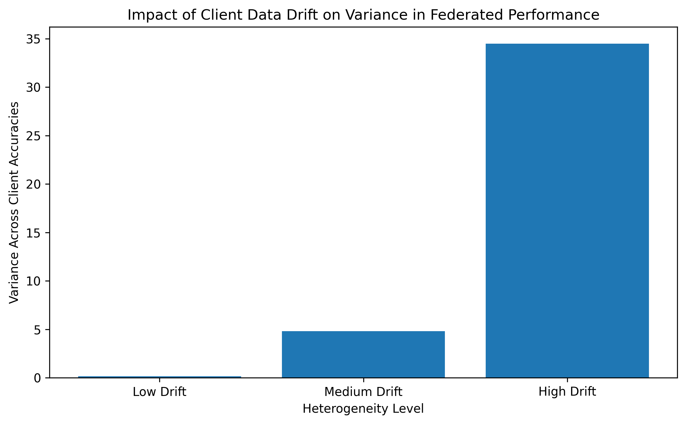

# Client Heterogeneity in Federated Learning: A Small Neural Network Simulation

## Overview
This project simulates an iterative federated learning setting to study how increasing statistical heterogeneity across clients affects the consistency of an aggregated global model.

## Experimental Design
- **Model:** A small feed-forward neural network with 3 input features, 1 hidden layer of 8 units, and 1 binary output.
- **Clients:** 3 simulated clients.
- **Data-generating process:** All clients share the same underlying label-generation rule; heterogeneity is introduced only through feature-distribution drift.
- **Heterogeneity settings:** Low drift, medium drift, and high drift.
- **Federated procedure:** 5 federated rounds. In each round, clients train locally for 10 epochs using Adam, followed by central aggregation via FedAvg.

## Why This Matters
Federated learning systems often operate under non-IID client data distributions. This toy experiment isolates one form of heterogeneity—statistical feature drift—and examines how it affects the consistency of a single global model across clients.

## Main Observation
As client drift increases, the aggregated global model becomes less consistent across local client datasets, reflected in higher variance across client-level accuracies. This illustrates a central challenge of federated learning: a single global model may not fit all clients equally well when local data distributions diverge.

## Result

## Notes
This is a small-scale simulation intended to illustrate how statistical heterogeneity affects global model consistency in federated learning. It does not aim to reproduce full-scale federated systems.

## Files
- `fl_client_heterogeneity.py` — main simulation script
- `heterogeneity_variance.png` — variance plot generated by the experiment
